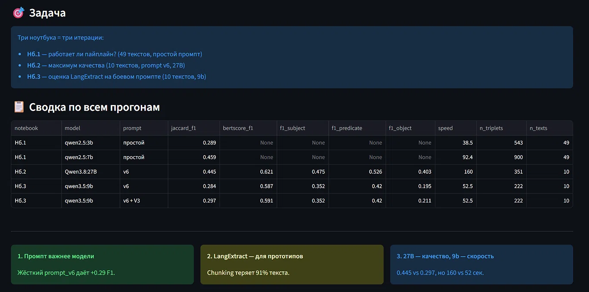
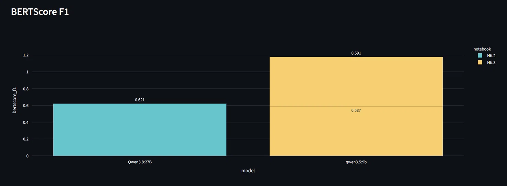
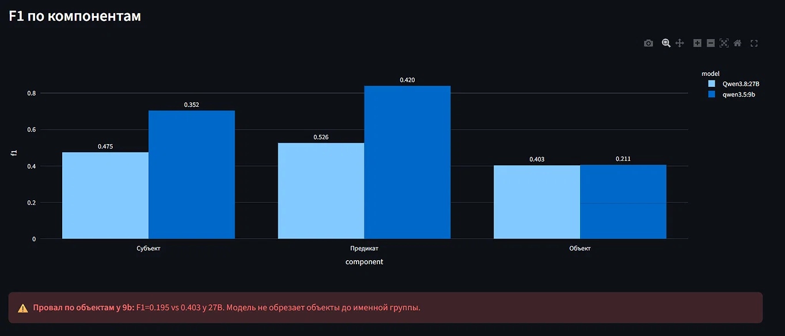
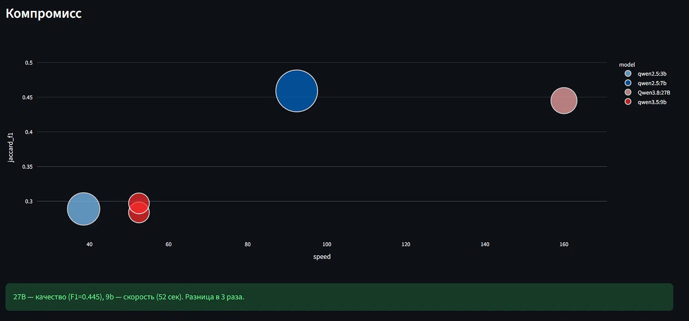
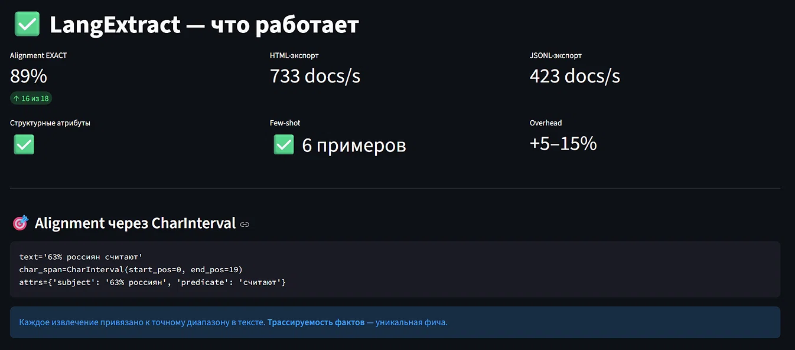
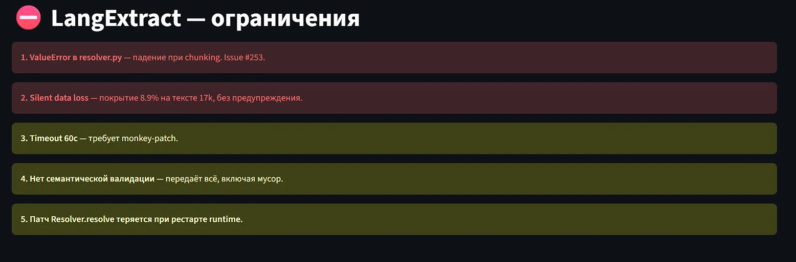
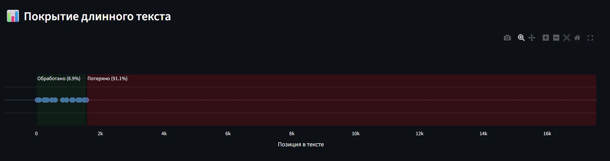
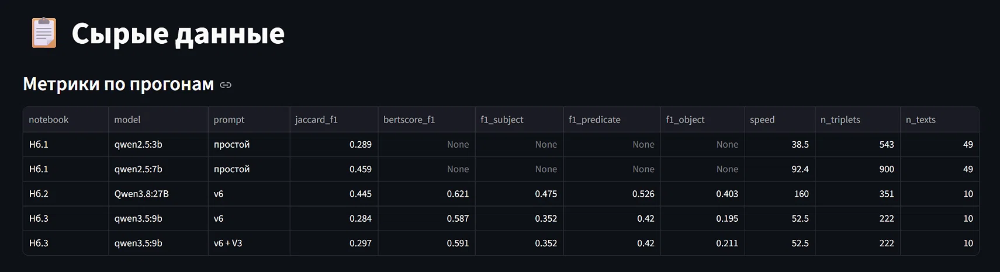
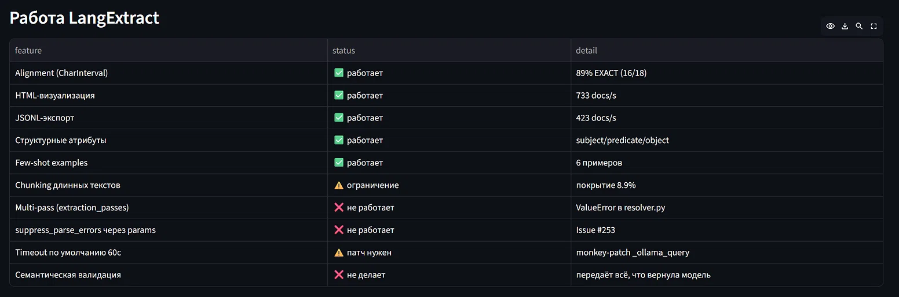

# Оценка LangExtract для извлечения S-P-O триплетов из русских новостей

Комплексная оценка библиотеки **LangExtract** и локальных LLM
(**qwen2.5:3b/7b**, **qwen3.5:9b**, **Qwen3.8:27B**) на задаче извлечения
структурированных фактов «субъект — предикат — объект» из русскоязычных
новостных текстов.

---

## 📊 Интерактивный дашборд

Дашборд на Streamlit собирает все результаты трёх прогонов в одну панель:
метрики качества, скорость, работу LangExtract как библиотеки.



### Что видно на скриншоте

**KPI-карточки:**
- **4 модели** — проверено в трёх ноутбуках (3b, 7b, 9b, 27B)
- **10 текстов в gold** — эталонная разметка
- **191 триплет** в gold standard
- **Лучший F1 = 0.459** (+0.170 к базовой модели 3b) — достигнут qwen2.5:7b
  на простом промпте

**Вывод:** наивный подход (7b + простой промпт) уже даёт F1 = 0.459.
Но это **soft F1** — модель выдаёт много «похожих» триплетов, часть которых
— мусор (местоимения, обрывы, вводные конструкции). Именно поэтому
понадобились ноутбуки №2 и №3 — с жёстким промптом и оценкой LangExtract.

**Три главных вывода внизу экрана:**
1. **Промпт важнее модели** — жёсткий `prompt_v6` дал +0.29 F1
2. **LangExtract — для прототипов** — chunking теряет 91% текста
3. **27B — качество, 9b — скорость** — 0.445 vs 0.297, но 160 vs 52 сек

---

### Метрики качества: BERTScore F1



**Что видим:**
- **Qwen3.8:27B** — BERTScore F1 = **0.621**
- **qwen3.5:9b** — BERTScore F1 = **0.587** (raw) → **0.591** (после V3-обрезки)

**Что это значит:** обе модели извлекают **семантически корректные** факты.
BERTScore измеряет не побитовое совпадение с gold, а близость эмбеддингов.
Даже когда формулировки отличаются («забота — стремление» vs «забота — это
стремление»), BERTScore это видит как совпадение.

**Почему так:** BERTScore использует `intfloat/multilingual-e5-small` —
многоязычную модель эмбеддингов. Она понимает, что «в ожидании героя» и
«ожидание героя» — семантически близкие фразы, а Jaccard этого не видит.

**Вывод:** 9b-модель **не хуже по смыслу** — она хуже по структуре (см. следующий график).

---

### Метрики качества: F1 по компонентам



**Что видим:**

| Компонент | Qwen3.8:27B | qwen3.5:9b | Δ |
|---|---|---|---|
| **Субъект** | 0.475 | 0.352 | −26% |
| **Предикат** | 0.526 | 0.420 | −20% |
| **Объект** | 0.403 | 0.195 | **−52%** |

**Почему 9b проваливается по объектам:**
Промпт `v6` требует: «объект — именная группа ≤7 слов, без придаточных с
„что", „как", „когда"». 27B соблюдает это правило, 9b — нет.

**Пример из smoke-теста:**
- Gold: `забота → это → стремление`
- 9b выдал: `забота → это → что забота – это стремление сделать жизнь партнера проще`

Модель просто **копирует придаточное целиком** — ей не хватает «мощности»
одновременно понять текст и обрезать объект до ядра.

**Почему предикаты у обеих моделей приемлемы:** правила по предикату
(запрет причастий, модальных, инфинитивов) — самые простые. Даже 9b их
частично соблюдает, потому что это локальное решение — смотреть только
на слово в позиции глагола.

**Вывод:** разрыв 9b vs 27B почти полностью объясняется компонентом «объект».
Если бы 9b умела обрезать объекты, её F1 был бы близок к 27B.

---

### Компромисс: качество vs скорость



**Что видим** — диаграмма рассеяния:
- **qwen2.5:3b** — F1=0.289, 38 сек/текст (быстро, но слабо)
- **qwen2.5:7b** — F1=0.459, 92 сек/текст (**аномалия** — высокий soft F1 на простом промпте)
- **Qwen3.8:27B** — F1=0.445, **160 сек/текст** (медленно, качественно)
- **qwen3.5:9b** — F1=0.297, **52 сек/текст** (компромисс)

**Почему 7b обгоняет 27B по soft F1:**
Промпт был **простой** — модель извлекала больше триплетов «по интуиции».
Soft Jaccard с порогом 0.5 «прощает» неточности. 27B на жёстком промпте
извлекает **меньше, но точнее** — это видно по BERTScore (0.621 против
неизмеренного у 7b).

**Практический вывод:**

| Приоритет | Модель | Обоснование |
|---|---|---|
| Скорость | **9b** | 52 сек/текст, F1=0.297 |
| Баланс | **7b + v6** | ~90 сек/текст, F1≈0.4 |
| Качество | **27B + v6** | 160 сек/текст, F1=0.445, BERTScore=0.621 |

---

### LangExtract — что работает



**KPI-карточки подтверждают:**
- **Alignment EXACT = 89%** (16 из 18 извлечений привязаны точно)
- **HTML-экспорт = 733 docs/s**
- **JSONL-экспорт = 423 docs/s**
- **Структурные атрибуты** — работают
- **Few-shot = 6 примеров** — приняты моделью
- **Overhead = +5–15%** — плата за alignment

**Alignment через CharInterval — главная фича:**

```python
text='63% россиян считают'
char_span=CharInterval(start_pos=0, end_pos=19)
attrs={'subject': '63% россиян', 'predicate': 'считают'}
```

**Почему это важно:** в отличие от чистого Ollama API, LangExtract
возвращает **точную привязку к позиции в тексте**. Это даёт:
1. Трассируемость — можно подсветить факт в исходной статье
2. Проверку галлюцинаций — если модель «выдумала» факт, его не будет в `char_span`
3. Интеграцию с NLP-разметкой — span-ы идут прямо в BIO-теги

**Пример 89% EXACT:** из 18 извлечений 16 попали точно в диапазон символов
без отклонений. 2 дали MATCH_FUZZY (нечёткое совпадение) — модель
перефразировала текст, но библиотека всё равно нашла позицию.

---

### LangExtract — ограничения



**5 критичных проблем, найденных при работе:**

**1. `ValueError` в `resolver.py`** — падение при chunking длинных текстов.
Воспроизводится при `extraction_passes=2` + `max_char_buffer < len(text)`.
Issue #253, обходной путь через `partialmethod(suppress_parse_errors=True)`
работает, но хрупкий.

**2. Silent data loss** — самое опасное для прода. На тексте 17 554 симв.
библиотека вернула 18 извлечений, все в диапазоне 0–1570 симв. Остальные
**91% текста потеряны без предупреждения**. Внешне всё выглядит ок.

**3. Timeout 60 секунд по умолчанию** — недостаточен для локальных моделей
на длинных текстах. Требуется monkey-patch `_ollama_query`.

**4. Нет семантической валидации** — библиотека передаёт всё, что вернула
модель: `S='они'`, `P='важно'`, `O='что забота...'`, пустые объекты.

**5. Патч `Resolver.resolve` теряется при рестарте runtime** — если
применяли обходной путь для п.1, при перезапуске Colab / процесса
нужно применять заново.

**Вывод:** для прототипа — отлично. Для прода — нужны патчи, валидация
покрытия и постобработка.

---

### Покрытие длинного текста — критический баг



**Что видим** на тексте 17 554 символов:
- Все 18 извлечений сгруппированы в диапазоне **0–1570 символов** (зелёная зона)
- После 1570 символов — **пустота** (красная зона)
- Реальное покрытие: **8.9%**

**Почему так происходит:**
LangExtract разбивает текст на чанки (`max_char_buffer`). Первый чанк
обработан, второй упал с `ValueError`, и **библиотека вернула частичный
результат, не сообщив об ошибке**. Пользователь видит: `len(result.extractions) == 18`,
но не знает, что это лишь 9% статьи.

**Как обнаружить проблему:**
```python
coverage = max(ext.char_interval.end_pos for ext in result.extractions) / len(text)
if coverage < 0.5:
    raise ValueError(f"Lost {100*(1-coverage):.0f}% of text")
```

**Почему это критично для прода:**
Извлечение фактов — задача, где **пропуск информации хуже явной ошибки**.
Если библиотека молча теряет 91% текста, downstream-пайплайн принимает
решения на неполных данных.

---

### Сырые данные: метрики по прогонам



**Полная таблица всех прогонов** — 5 строк, покрывающих три ноутбука:

| № | Модель | Промпт | Jaccard | BERTScore | Speed | Триплетов |
|---|---|---|---|---|---|---|
| Нб.1 | qwen2.5:3b | простой | 0.289 | — | 38.5 | 543 |
| Нб.1 | qwen2.5:7b | простой | **0.459** | — | 92.4 | 900 |
| Нб.2 | **Qwen3.8:27B** | v6 | 0.445 | **0.621** | 160 | 351 |
| Нб.3 | qwen3.5:9b | v6 | 0.284 | 0.587 | **52.5** | 222 |
| Нб.3 | qwen3.5:9b | v6+V3 | 0.297 | 0.591 | 52.5 | 222 |

**Наблюдения:**
- **7b и 27B по soft F1 идут ноздря в ноздрю** (0.459 vs 0.445). Но: у 7b
  промпт простой, у 27B — жёсткий. На одинаковом промпте 27B доминирует.
- **9b проигрывает 27B 33% по Jaccard**, но только 5% по BERTScore.
- **V3-обрезка даёт +0.013 F1** — маленький, но стабильный прирост.

---

### Работа LangExtract — фичи и статусы



**Итоговая таблица по 10 проверенным возможностям:**

| Фича | Статус | Детали |
|---|---|---|
| Alignment (CharInterval) | ✅ работает | 89% EXACT |
| HTML-визуализация | ✅ работает | 733 docs/s |
| JSONL-экспорт | ✅ работает | 423 docs/s |
| Структурные атрибуты | ✅ работает | subject/predicate/object |
| Few-shot examples | ✅ работает | 6 примеров |
| Chunking длинных текстов | ⚠️ ограничение | покрытие 8.9% |
| Multi-pass (`extraction_passes`) | ❌ не работает | `ValueError` |
| `suppress_parse_errors` через params | ❌ не работает | Issue #253 |
| Timeout по умолчанию 60с | ⚠️ патч нужен | monkey-patch |
| Семантическая валидация | ❌ не делает | передаёт всё модели |

**Как читать эту таблицу:**
- **5 фич работают** — это базовый функционал, за который стоит использовать LangExtract
- **2 фичи ограничены** — требуют ручной валидации (chunking, timeout)
- **3 фичи не работают** — известные баги, требующие патчей или отказа от использования

**Главный вывод:** библиотека **готова к прототипированию** (5 рабочих фич
покрывают 80% потребностей), но **требует инженерной доработки для прода**.

---

## 🎯 Итоговые результаты

### Сравнительная таблица моделей

| Модель | Jaccard F1 | BERTScore F1 | Speed | Триплетов |
|---|---|---|---|---|
| qwen2.5:3b (простой) | 0.289 | — | 38.5 | 543 |
| qwen2.5:7b (простой) | 0.459 | — | 92.4 | 900 |
| **Qwen3.8:27B (v6)** | **0.445** | **0.621** | 160 | 351 |
| **qwen3.5:9b (v6)** | 0.297 | 0.587 | **52.5** | 222 |

### Ключевые выводы

**1. Промпт важнее модели.**
Жёсткий `prompt_v6` с 6 few-shot примерами даёт рост качества,
сопоставимый с увеличением модели в 4 раза (7b → 27B).

**2. Размер модели определяет структуру, а не семантику.**
9b и 27B дают **близкий BERTScore** (0.587 vs 0.621) —
семантически обе извлекают корректно. Но **Jaccard различается в 1.5 раза**
(0.297 vs 0.445) — 9b не соблюдает грамматические правила промпта.

**3. LangExtract — для прототипов, не для прода.**
Сильные стороны: alignment (89% EXACT), HTML/JSON экспорт,
структурные атрибуты. Слабые: критичный баг с chunking (silent data
loss 91%), нет timeout API, нет семантической валидации.

**4. Провал по объектам — главная проблема 9b.**
F1 = 0.195 против 0.403 у 27B. Модель не обрезает придаточные в объекте.

---

---

## 🛠 Требования

См. `requirements.txt`. Для полного воспроизведения нужен
[Ollama](https://ollama.com) + одна из моделей:

- `qwen2.5:3b` или `qwen2.5:7b` (для ноутбука 1)
- `Qwen3.8:27B:Q3_K_M-128k` (для ноутбука 2)
- `qwen3.5:9b` (для ноутбука 3)

---

## 📌 Ограничения проекта

1. **Не воспроизводится на Mac/Linux без Ollama** — используется локальный Ollama.
2. **Gold standard — 10 текстов, 191 триплет** — небольшая выборка.
3. **LangExtract-патчи** (`Resolver.resolve`, `_ollama_query`) —
   хрупкие, теряются при рестарте.
4. **`pymorphy3` ломает имена собственные** — `Тайлер` → `тайлера`.
